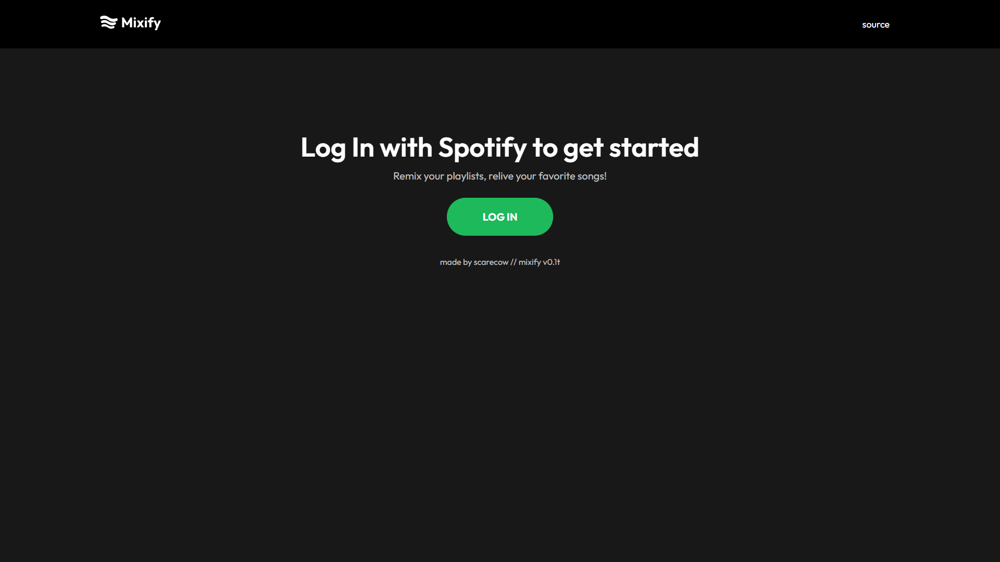
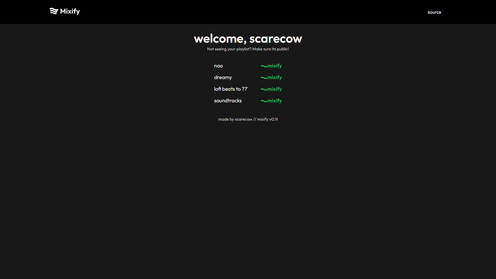
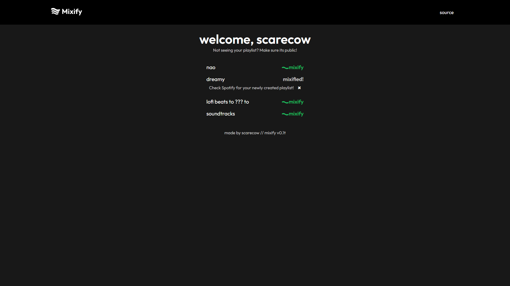

<div align="center">
  <br>
  <br>
  
  <br><br>
  <p>
    An app that takes your Spotify playlist and creates another one with remixes of the same songs 
  </p>

[Live Demo](https://mixify.rocks/)

</div>

<br />

## About the Project

<!-- Screenshots -->

### Screenshots

<div align="center"> 
  
  
  
</div>

### Demo Video

- [Mixify Demo](https://youtu.be/zF6Q_-VZbK8)

<!-- TechStack -->

### Tech Stack

  <ul>
    <li><a href="https://reactjs.org/">React.js</a></li>
    <li><a href="https://expressjs.com/">Express.js</a></li>
    <li><a href="https://developer.spotify.com/documentation/web-api/">Spotify Web API</a></li>
  </ul>

<!-- Color Reference -->

### Color Reference

| Color        | Hex                                                                     |
| ------------ | ----------------------------------------------------------------------- |
| Mixify Green |  #1BD95B |

<!-- Env Variables -->

### Environment Variables

To run this project, you will need to add the following environment variables to your .env file

`CLIENT_ID`

`CLIENT_SECRET`

`PASSWORD`

`SESSION_SECRET`

`BASE_URL`

`FRONTEND_URL`

<!-- Getting Started -->

## Getting Started

<!-- Prerequisites -->

### Prerequisites

- [Node.js](https://nodejs.org/en)

- Yarn package manager

```bash
 npm install --global yarn
```

<!-- Run Locally -->

### Run Locally

Clone the project

```bash
  git clone https://github.com/zahid47/mixify.git
```

Go to the backend directory

```bash
  cd mixify/backend
```

Install dependencies

```bash
  yarn install
```

Start the server

```bash
  yarn dev
```

Go to the frontend directory

```bash
  cd mixify/frontend
```

Install dependencies

```bash
  yarn install
```

Start the server

```bash
  yarn dev
```

<!-- Roadmap -->

## Roadmap

- [ ] Keep the user logged in using refresh tokens
- [ ] Add support for liked songs
- [ ] Create an ML model to classify if song X is a remix of song Y

<!-- Contact -->

## Contact

- [email](mailto:epiczahid@gmail.com)
- scarecow#2857 on discord

<!-- Acknowledgments -->

## Acknowledgements

- [Spotify Web API](https://developer.spotify.com/documentation/web-api/)
- [awesome-readme-template](https://github.com/Louis3797/awesome-readme-template)
- [Divide-By-0](https://github.com/Divide-By-0/ideas-for-projects-people-would-use)
